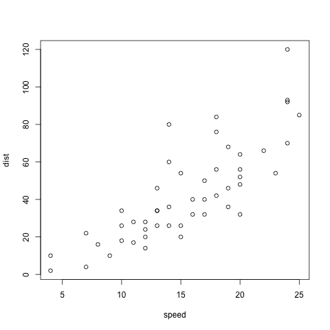

---
# This is a comment, you may remove fields that you don't use. Not all options are shown below. See `README.md`.
mode: man                     # enter only one of three document types, man, jou, or doc
floatsintext: true            # special handling of figures, tables with the text
classoption:                  # apa6 documentclass options (latex/pdf output)
    - noextraspace            # other options except floatsintext, man, jou, doc should go here.
subtitle: Markdown to APA     # running head title
author:                       # author list, each item is a GROUP of authors
    - Author One, Author Two  # these authors go with institute 1
    - Author Three            # these go with institute 2
institute:                    # institute list, matches author order
    - Institute One           # institute for Authors 1 and 2
    - Institute Two           # institute for Author 3
twogroups: true               # using the 'twogroups' field since authors span two universities
                              # this places authors with institutions in the output document
                              # if the field is missing, will align affiliations vertically
                              # other fields to use: threegroups, ..., sixgroups
                              # For alternative author/affiliation assignment:
# author: 
#     - Author One^1^, Author Two ^1,2^, Author Three^1,3,4,5^
# institute: 
#     - ^1^Affiliation One
#     - ^2^Affiliation Two
#     - ^3^Affiliation Three
#     - ^4^Affiliation Four
#     - ^5^Affiliation Five
bibliography:                 # delete bibliography field if not citing anything
    - references.bib          # use a new line for each .bib file
date: "Last updated: \\today" # date is optional, can delete if not needed
keywords:                     # enter as many keywords as needed as a list
    - sublime text
    - vscode
    - pandoc
    - apa6

# Multi-line YAML fields can be used if they are indented on the next line,
#  and with a "|" after the field. Two examples are 'authornote', and 'abstract', but
#  all of these can be on one line if you choose. Multi-line entries can contain LaTeX code,
#  such as '\noindent'.
title: |
    Writing an APA manuscript with Pandoc markdown
authornote: |
    \noindent Correspondence:

    Joseph M. Burling

    Department of Psychology

    6538 Franz Hall, UCLA

    Los Angeles, CA 90095-1563

    Email: jmburling@ucla.edu

abstract: |
    This is just an example of using pandoc (with the help of some build systems) to write in pandoc's markdown syntax for APA manuscripts. The output will be rendered in APA 6 format according to some commands and class options provided by the LaTeX `apa6` package. I also make use of a few pandoc filters downloaded as python modules to get cross-referencing to work. Lastly, I provide a .DOCX version of the build system, though a lot may not translate and will require some additional tweaking.

# some styling options
colorlinks: true
---


# Quick pandoc overview

The YAML metadata block is at the top of the document and take on key-value pairs like so:

```yaml
---
# string field with other characters should be quoted
title: "Some specials: Characters in the title?!?"

# toggle values
twogroups: true

# nested fields with text
joucommands:
    leftheader: some ascii text
    journal: other text

# lists
bibliography:
    - references.bib
    - other_references.bib

# multiline text
abstract: |
    lines go here
    and here.
---
```

Words go here, also here is a citation [@someArticle]. According to @anotherArticle, something bad happened. See Figure @fig:myplot. This is a bold statement... **WOW!**, and here's _some _emphasis for you_ too. Sometimes you need some typewriter-like font, like when writing code: `my_answer = 1 + 1`. Other types you may need to write blocks of code, like this:

```latex
\begin{table}
\centering
\begin{tabular}{|l|l|}\hline
Age & Frequency \\ \hline
18--25  & 15 \\
26--35  & 33 \\
36--45  & 22 \\ \hline
\end{tabular}
\end{table}
```


{#fig:myplot height=3.333in width=3.333in}


See Table @tbl:mytable for an example on making tables using the default extension. If tables are not referenced, then they are not given table numbers and arranged with other tables. In APA man mode, Tables are sent to the end of the document unless the following is used in the YAML header at the top of this document:

```yaml
floatsintext: true
```


 Right Left  Default  Center
------ ----- ------- --------
12     12    12      12
123    123   123     123
1      1     1       1

Table: A table. {#tbl:mytable}

<!-- This is a comment -->

- This is another type of pandoc table (@tbl:anotherone). It should look the same.[^1]

| Right | Left | Default | Center |
|------:|:-----|---------|:------:|
|   12  |  12  |    12   |    12  |
|  123  |  123 |   123   |   123  |
|    1  |    1 |     1   |     1  |

Table: Another one {#tbl:anotherone}

[^1]: Sometimes docx files will have tables that are squished. Autofit the document width to fix.

<!--
This is
another
comment
-->

\newpage

+---------------+---------------+--------------------+
| Fruit         | Price         | Advantages         |
+===============+===============+====================+
| Bananas       | $1.34         | - built-in wrapper |
|               |               | - bright color     |
+---------------+---------------+--------------------+
| Oranges       | $2.10         | - cures scurvy     |
|               |               | - tasty            |
+---------------+---------------+--------------------+

Table: And another multi-line table which is more complicated to make. It may require a pagebreak in two-column (jou) mode because pandoc uses `longtable` which doesn't work in two-column mode. It has no reference so it doesn't start with "Table x." Some additional latex hacks are added to the template to allow it to work (at the risk of losing content or bleeding off the page. Blame pandoc for using `longtable`).


Here's some raw latex code. It won't be recognized unless the output is LaTeX/pdf and you have to proper parse-raw option set. It's the same LaTeX code block from above rendered as an actual Table \ref{tbl:rawtex}. The position may shift because it's a floating environment.

\begin{table}
\centering
\caption{Using raw latex code}
\label{tbl:rawtex}
\begin{tabular}{|l|l|}\hline
Age & Frequency \\ \hline
18--25  & 15 \\
26--35  & 33 \\
36--45  & 22 \\ \hline
\end{tabular}
\end{table}


Checking rendering of Table {@tbl:tbllong}.

 id     sess     cond     rep      trial        age      demographic   gender   maturation
----- --------- ------ --------- ---------- ----------- ------------- -------- ------------
 S01   -0.1706    -B    -0.2317   -0.3189    -0.004132      1.103        -m        -pre
 S01   -0.1706    -A    -0.2317   -0.2226    -0.004132      1.103        -m        -pre
 S01   -0.1706    -C    -0.2317   -0.1262    -0.004132      1.103        -m        -pre
 S01   -0.1706    -C     0.061    -0.02987   -0.004132      1.103        -m        -pre
 S01   -0.1706    -A     0.061    0.06647    -0.004132      1.103        -m        -pre
 S01   -0.1706    -A    0.3537     0.1628    -0.004132      1.103        -m        -pre
 S01   -0.1706    -C    0.3537     0.2591    -0.004132      1.103        -m        -pre
 S01   -0.1706    -B     0.061     0.3555    -0.004132      1.103        -m        -pre
 S01   -0.1706    -B    0.3537     0.4518    -0.004132      1.103        -m        -pre
 S01   -0.1706    -C    0.6463     0.5482    -0.004132      1.103        -m        -pre
 S01   -0.1706    -C     0.939     0.6445    -0.004132      1.103        -m        -pre
 S01   -0.1706    -B    0.6463     0.7409    -0.004132      1.103        -m        -pre
 S01   -0.1706    -A    0.6463     0.8372    -0.004132      1.103        -m        -pre
 S01   -0.1706    -B     0.939     0.9335    -0.004132      1.103        -m        -pre
 S01   -0.1706    -B     1.232      1.03     -0.004132      1.103        -m        -pre
 S01   -0.1706    -A     0.939     1.126     -0.004132      1.103        -m        -pre
 S01   -0.1706    -A     1.232     1.223     -0.004132      1.103        -m        -pre
 S01   -0.1706    -C     1.232     1.319     -0.004132      1.103        -m        -pre
 S02   -0.1706    -B    -0.2317   -0.3189     0.01387      0.2929        -m        -pre
 S02   -0.1706    -A    -0.2317   -0.2226     0.01387      0.2929        -m        -pre
 S02   -0.1706    -C    -0.2317   -0.1262     0.01387      0.2929        -m        -pre
 S02   -0.1706    -A     0.061    -0.02987    0.01387      0.2929        -m        -pre
 S02   -0.1706    -A    0.3537    0.06647     0.01387      0.2929        -m        -pre
 S02   -0.1706    -C     0.061     0.1628     0.01387      0.2929        -m        -pre
 S02   -0.1706    -C    0.3537     0.2591     0.01387      0.2929        -m        -pre
 S02   -0.1706    -A    0.6463     0.3555     0.01387      0.2929        -m        -pre
 S02   -0.1706    -B     0.061     0.4518     0.01387      0.2929        -m        -pre
 S02   -0.1706    -B    0.3537     0.5482     0.01387      0.2929        -m        -pre
 S02   -0.1706    -B    0.6463     0.6445     0.01387      0.2929        -m        -pre
 S02   -0.1706    -A     0.939     0.7409     0.01387      0.2929        -m        -pre
 S02   -0.1706    -A     1.232     0.8372     0.01387      0.2929        -m        -pre
 S02   -0.1706    -C    0.6463     0.9335     0.01387      0.2929        -m        -pre
 S02   -0.1706    -C     0.939      1.03      0.01387      0.2929        -m        -pre
 S02   -0.1706    -B     0.939     1.126      0.01387      0.2929        -m        -pre
 S02   -0.1706    -C     1.232     1.223      0.01387      0.2929        -m        -pre
 S02   -0.1706    -B     1.232     1.319      0.01387      0.2929        -m        -pre
 S03   -0.1706    -A    -0.2317   -0.3189     -0.2321       1.464        -m        -pre
 S03   -0.1706    -B    -0.2317   -0.2226     -0.2321       1.464        -m        -pre
 S03   -0.1706    -A     0.061    -0.1262     -0.2321       1.464        -m        -pre
 S03   -0.1706    -C    -0.2317   -0.02987    -0.2321       1.464        -m        -pre
 S03   -0.1706    -B     0.061    0.06647     -0.2321       1.464        -m        -pre
 S03   -0.1706    -A    0.3537     0.1628     -0.2321       1.464        -m        -pre
 S03   -0.1706    -A    0.6463     0.2591     -0.2321       1.464        -m        -pre
 S03   -0.1706    -B    0.3537     0.3555     -0.2321       1.464        -m        -pre
 S03   -0.1706    -C     0.061     0.4518     -0.2321       1.464        -m        -pre
 S03   -0.1706    -C    0.3537     0.5482     -0.2321       1.464        -m        -pre
 S03   -0.1706    -A     0.939     0.6445     -0.2321       1.464        -m        -pre
 S03   -0.1706    -C    0.6463     0.7409     -0.2321       1.464        -m        -pre
 S03   -0.1706    -B    0.6463     0.8372     -0.2321       1.464        -m        -pre
 S03   -0.1706    -C     0.939     0.9335     -0.2321       1.464        -m        -pre

Table: Testing a longtable. {#tbl:tbllong}

- Here's an example of inline LaTeX math, $p=.0499$.

- Here's a an example of using LaTeX syntax for displaying equations.

$$
\hat{y} = \beta_0 + \beta_1 x
$$

Pandoc doesn't know how to make inline headings when converting to Word. If you put the cursor at the end of the heading, press Ctrl+Alt+Enter and it will move it down.

## Subsection heading

Lorem ipsum dolor sit amet, consectetur adipiscing elit. Nulla et magna vitae ipsum rhoncus congue eu vehicula sem. Vestibulum venenatis mauris ac urna porta placerat. Ut ante neque, malesuada ut lobortis ullamcorper, consectetur vitae ipsum. Morbi sodales, justo eu pretium venenatis, sem libero dapibus sem, at molestie lectus felis ut nunc. Praesent ultrices sagittis porta. Curabitur diam elit, lacinia nec egestas sit amet, convallis a felis. Praesent dictum nec mauris quis molestie. Proin ullamcorper, mauris sed molestie aliquet, nisi sapien tempor risus, quis congue sapien turpis et justo. Suspendisse potenti.

Duis viverra aliquet metus, eget aliquam tellus mollis imperdiet. Lorem ipsum dolor sit amet, consectetur adipiscing elit. Nulla et magna vitae ipsum rhoncus congue eu vehicula sem. Vestibulum venenatis mauris ac urna porta placerat. Ut ante neque, malesuada ut lobortis ullamcorper, consectetur vitae ipsum. Morbi sodales, justo eu pretium venenatis, sem libero dapibus sem, at molestie lectus felis ut nunc. Praesent ultrices sagittis porta. Curabitur diam elit, lacinia nec egestas sit amet, convallis a felis.

### Subsubsection heading

Nullam nec est ut mauris eleifend pulvinar ac in nisl. In eleifend, velit et rhoncus pretium, justo lectus viverra enim, nec feugiat ante mauris vitae magna. Lorem ipsum dolor sit amet, consectetur adipiscing elit. Morbi felis nulla, iaculis dapibus sapien quis, pretium laoreet est. Mauris vel sapien tempor, dapibus ipsum sit amet, sagittis tellus. Aliquam ipsum metus, ultricies eleifend dolor nec, ultricies mollis sapien. Integer placerat ante condimentum sagittis elementum. Fusce aliquam, libero a iaculis eleifend, ipsum ante tincidunt ante, ut bibendum dolor risus ut nibh. Sed fermentum tellus id ligula sodales, ut condimentum tortor tempus. Phasellus suscipit dapibus est sed consectetur.

Nullam nec est ut mauris eleifend pulvinar ac in nisl. In eleifend, velit et rhoncus pretium, justo lectus viverra enim, nec feugiat ante mauris vitae magna. Lorem ipsum dolor sit amet, consectetur adipiscing elit. Morbi felis nulla, iaculis dapibus sapien quis, pretium laoreet est. Mauris vel sapien tempor, dapibus ipsum sit amet, sagittis tellus. Aliquam ipsum metus, ultricies eleifend dolor nec, ultricies mollis sapien. Integer placerat ante condimentum sagittis elementum. Fusce aliquam, libero a iaculis eleifend, ipsum ante tincidunt ante, ut bibendum dolor risus ut nibh. Sed fermentum tellus id ligula sodales, ut condimentum tortor tempus. Phasellus suscipit dapibus est sed consectetur.

#### Paragraph heading

Lorem ipsum dolor sit amet, consectetur adipiscing elit. Nulla et magna vitae ipsum rhoncus congue eu vehicula sem. Vestibulum venenatis mauris ac urna porta placerat. Ut ante neque, malesuada ut lobortis ullamcorper, consectetur vitae ipsum. Morbi sodales, justo eu pretium venenatis, sem libero dapibus sem, at molestie lectus felis ut nunc.
Praesent ultrices sagittis porta. Curabitur diam elit, lacinia nec egestas sit amet, convallis a felis. Praesent dictum nec mauris quis molestie. Proin ullamcorper, mauris sed molestie aliquet, nisi sapien tempor risus, quis congue sapien turpis et justo. Suspendisse potenti. Duis viverra aliquet metus, eget aliquam tellus mollis imperdiet.

##### Subparagraph heading

Lorem ipsum dolor sit amet, consectetur adipiscing elit. Nulla et magna vitae ipsum rhoncus congue eu vehicula sem. Vestibulum venenatis mauris ac urna porta placerat. Ut ante neque, malesuada ut lobortis ullamcorper, consectetur vitae ipsum. Morbi sodales, justo eu pretium venenatis, sem libero dapibus sem, at molestie lectus felis ut nunc.
Praesent ultrices sagittis porta. Curabitur diam elit, lacinia nec egestas sit amet, convallis a felis. Praesent dictum nec mauris quis molestie. Proin ullamcorper, mauris sed molestie aliquet, nisi sapien tempor risus, quis congue sapien turpis et justo. Suspendisse potenti. Duis viverra aliquet metus, eget aliquam tellus mollis imperdiet.

###### Getting silly with the amount of subheadings

Lorem ipsum dolor sit amet, consectetur adipiscing elit. Nulla et magna vitae ipsum rhoncus congue eu vehicula sem. Vestibulum venenatis mauris ac urna porta placerat. Ut ante neque, malesuada ut lobortis ullamcorper, consectetur vitae ipsum. Morbi sodales, justo eu pretium venenatis, sem libero dapibus sem, at molestie lectus felis ut nunc. Praesent ultrices sagittis porta. Curabitur diam elit, lacinia nec egestas sit amet, convallis a felis. Praesent dictum nec mauris quis molestie. Proin ullamcorper, mauris sed molestie aliquet, nisi sapien tempor risus, quis congue sapien turpis et justo. Suspendisse potenti. Duis viverra aliquet metus, eget aliquam tellus mollis imperdiet.

Nullam nec est ut mauris eleifend pulvinar ac in nisl. In eleifend, velit et rhoncus pretium, justo lectus viverra enim, nec feugiat ante mauris vitae magna. Lorem ipsum dolor sit amet, consectetur adipiscing elit. Morbi felis nulla, iaculis dapibus sapien quis, pretium laoreet est. Mauris vel sapien tempor, dapibus ipsum sit amet, sagittis tellus. Aliquam ipsum metus, ultricies eleifend dolor nec, ultricies mollis sapien. Integer placerat ante condimentum sagittis elementum. Fusce aliquam, libero a iaculis eleifend, ipsum ante tincidunt ante, ut bibendum dolor risus ut nibh. Sed fermentum tellus id ligula sodales, ut condimentum tortor tempus. Phasellus suscipit dapibus est sed consectetur.

####### Heading 7

Lorem ipsum dolor sit amet, consectetur adipiscing elit.

######## Heading 8

Lorem ipsum dolor sit amet, consectetur adipiscing elit.

\newpage
\noindent
\vspace{-2em}
\setlength{\parindent}{-0.5in}
\setlength{\leftskip}{0.5in}
\setlength{\parskip}{15pt}

# References
